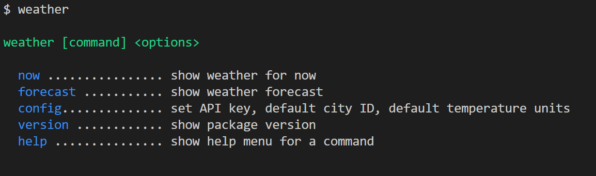
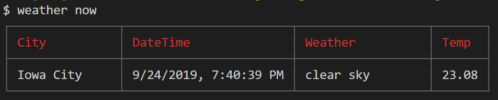
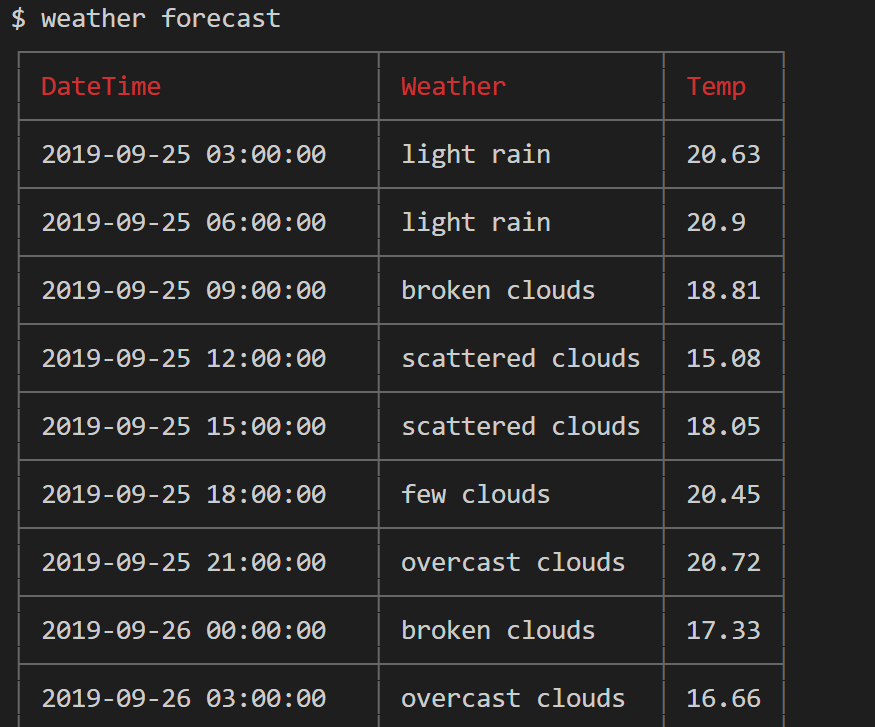

# Weather CLI in Node.js

[](https://ko-fi.com/I3I63W4OK)

A weather CLI app in Node.js. The app checks weather in command line.

[](https://www.npmjs.com/package/best-weather-cli)

## [Medium Article](https://codeburst.io/build-a-command-line-interface-cli-application-with-node-js-59becec90e28)

## Usages

```sh
npm i -g best-weather-cli
weather
weather config -k={your api key} -c={your city id} -u={temperature units}
weather now
weather forecast
```

## Screenshots

### `main menu`



### `weather now`



### `weather forecast`



## How to build locally

```sh
npm i
npm link
```

## License

Feel free to use the code in this repository as it is under MIT license.

[](https://ko-fi.com/I3I63W4OK)
